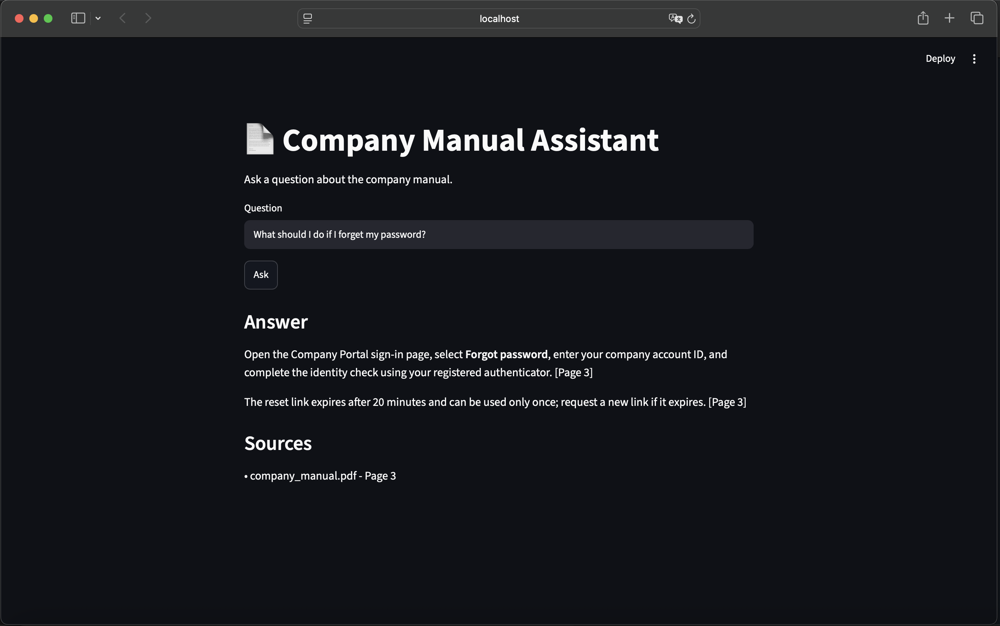

# 📄 Company Manual RAG Assistant

A Retrieval-Augmented Generation (RAG) application that answers questions about a company manual using semantic search and an LLM.

The application extracts and chunks a PDF company manual, generates embeddings, stores them in a Chroma vector database, retrieves relevant information for a user's question, and generates an answer with page citations.

A Streamlit interface allows users to interact with the system through a simple web UI.

---

## 🖥️ Demo




## 🚀 Features

- PDF text extraction using `pypdf`
- Recursive text chunking with LangChain
- OpenAI embeddings for semantic representation
- Chroma vector database for similarity search
- Top-k document retrieval
- Distance threshold for filtering low-relevance queries
- `NOT_FOUND` handling when the manual does not contain the answer
- LLM-generated answers restricted to retrieved context
- Page-level source citations
- Streamlit web interface
- Retrieval evaluation using a custom question set
- Threshold and Top-k evaluation

---

## 🏗 Architecture

```text
Company Manual (PDF)
        ↓
Text Extraction
        ↓
RecursiveCharacterTextSplitter
        ↓
OpenAI Embeddings
        ↓
Chroma Vector Database
        ↓
User Question
        ↓
Question Embedding
        ↓
Similarity Search (Top-k = 3)
        ↓
Distance Threshold (1.30)
        ↓
Relevant Context
        ↓
LLM
        ↓
Answer + Page Citation
```

The system uses retrieval before generation so that the LLM answers using information from the company manual rather than relying only on its general knowledge.

---

## 🛠 Tech Stack

- Python
- LangChain
- OpenAI API
- OpenAI Embeddings
- Chroma
- Streamlit
- pypdf
- Git / GitHub

---

## 🔍 How It Works

### 1. Document Processing

The PDF company manual is loaded with `pypdf`.

The document is split page-by-page and then divided into smaller chunks using LangChain's `RecursiveCharacterTextSplitter`.

Each chunk retains metadata including:

- Source filename
- Page number

### 2. Embedding

Each text chunk is converted into a vector using:

```text
text-embedding-3-small
```

The vectors and document metadata are stored in Chroma.

### 3. Retrieval

When a user asks a question:

1. The question is converted into an embedding.
2. Chroma performs vector similarity search.
3. The top 3 chunks are retrieved.
4. A distance threshold is applied to reject low-relevance results.

The current prototype uses:

```text
Top-k = 3
Distance threshold = 1.30
```

These values were selected based on a small evaluation dataset and should not be treated as universal settings.

### 4. Answer Generation

Retrieved chunks are passed to the LLM as context.

The prompt instructs the model to:

- Answer only using the provided context
- Avoid inventing company policies
- Return `NOT_FOUND` if the answer is unavailable
- Include page citations for supporting information

Example:

```text
Question:
What should I do if I forget my password?

Answer:
Open the Company Portal sign-in page, select Forgot password,
enter your company account ID, and complete the identity check
using your registered authenticator. [Page 3]
```

---

## 📊 Evaluation

A small evaluation dataset was created containing both:

- Questions whose answers exist in the manual
- Questions whose answers do not exist in the manual

This was used to evaluate the retrieval threshold.

### Threshold Evaluation

| Threshold | Accuracy |
|-----------|----------|
| 1.10 | 81.2% |
| 1.15 | 81.2% |
| 1.20 | 93.8% |
| 1.25 | 93.8% |
| **1.30** | **100.0%** |
| 1.35 | 75.0% |
| 1.40 | 68.8% |

On this 16-question evaluation set, a threshold of `1.30` produced:

```text
False Positives: 0
False Negatives: 0
```

This result is specific to the small test dataset and is not intended to demonstrate general RAG accuracy.

### Top-k Evaluation

For answerable questions, retrieval was also evaluated by checking whether the expected page appeared among the retrieved results.

| Metric | Result |
|--------|--------|
| Hit@1 | 100% |
| Hit@3 | 100% |
| Hit@5 | 100% |

Increasing `k` did not improve page-level retrieval on the current evaluation set and introduced additional irrelevant chunks.

The application currently uses `k=3` as a practical balance because some questions may require information from multiple chunks.

---

## 💻 Installation

Clone the repository:

```bash
git clone https://github.com/Dongan-kim/company-manual-rag-assistant.git
cd company-manual-rag-assistant
```

Create a virtual environment:

```bash
python -m venv .venv
source .venv/bin/activate
```

Install dependencies:

```bash
pip install -r requirements.txt
```

Create a `.env` file:

```text
OPENAI_API_KEY=your_api_key_here
```

The `.env` file is excluded from Git using `.gitignore`.

---

## ▶️ Usage

First, build the vector database:

```bash
python src/langchain_store.py
```

Then start the Streamlit application:

```bash
streamlit run app.py
```

Open the local Streamlit URL shown in the terminal and ask questions about the company manual.

Example questions:

```text
What should I do if I forget my password?

How many vacation days do full-time employees receive?

Can I work remotely?

How do I submit a business expense?
```

The application will retrieve relevant sections of the manual and generate an answer with source-page citations.

---

## 📁 Project Structure

```text
rag-poc/
│
├── app.py
├── README.md
├── requirements.txt
├── .gitignore
│
├── data/
│   └── company_manual.pdf
│
└── src/
    ├── embedding_demo.py
    ├── simple_search.py
    ├── store_documents.py
    ├── search_chroma.py
    ├── pdf_chunking.py
    ├── store_pdf.py
    ├── search_pdf.py
    ├── rag.py
    ├── store_pdf_v2.py
    ├── rag_v2.py
    ├── langchain_chunking.py
    ├── langchain_store.py
    ├── langchain_search.py
    ├── langchain_rag.py
    ├── retrieval_evaluation.py
    ├── evaluate_retrieval.py
    ├── evaluate_thresholds.py
    └── evaluate_k.py
```

The repository includes earlier implementations to show the progression from manual embedding and vector-search experiments to the final LangChain-based RAG pipeline.

---

## ⚠️ Limitations

This project is a proof of concept.

Current limitations include:

- Evaluation uses a small manually created question set.
- The retrieval threshold is tuned specifically for the included manual.
- Page citations are generated by the LLM from retrieved context and are not guaranteed to be perfectly attributed.
- The system currently supports a single PDF knowledge source.
- Retrieval quality may change with different documents, embedding models, or chunking strategies.

---

## 🔮 Future Improvements

Possible improvements include:

- Structured output for more reliable citations
- Chunk-level citation IDs
- Larger retrieval evaluation datasets
- Reranking retrieved documents
- Support for multiple documents
- Conversation history
- Automated RAG evaluation
- Improved Streamlit UI
- Deployment as a hosted web application

---

## 🎯 Project Goal

This project was built to explore the practical implementation and evaluation of Retrieval-Augmented Generation.

Rather than only building a basic RAG pipeline, the project also examines retrieval behavior, threshold selection, Top-k selection, hallucination reduction, and source attribution.